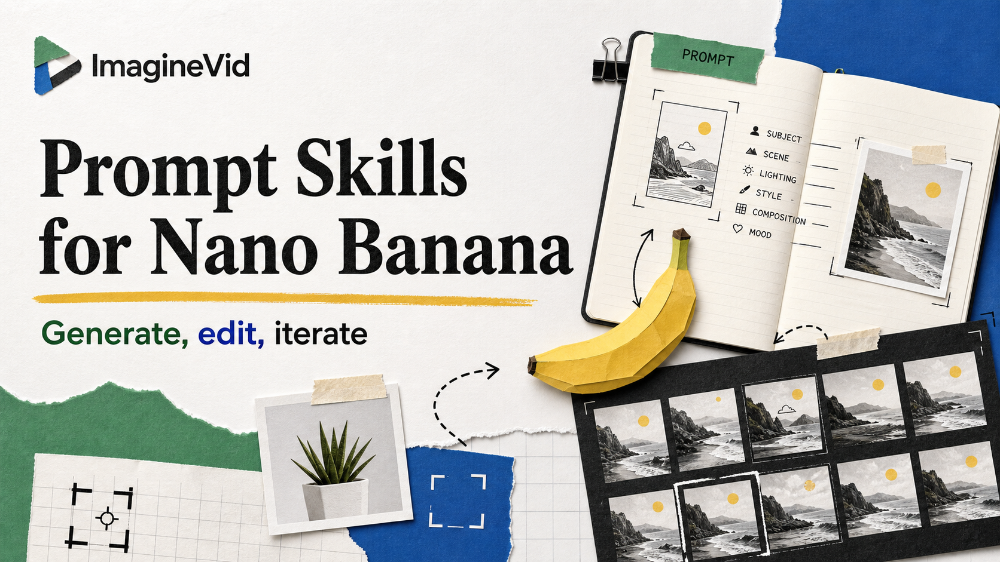

<a href="https://github.com/imaginevid-ai/Awesome-nano-banana-prompts-and-skills">
  
</a>

> A source-verified field guide to useful workflows with the original Nano Banana model.
# Awesome Nano Banana Prompts & Skills

[](https://github.com/sindresorhus/awesome)
[](https://github.com/imaginevid-ai/Awesome-nano-banana-prompts-and-skills)
[](https://creativecommons.org/licenses/by/4.0/)
[](https://github.com/imaginevid-ai/Awesome-nano-banana-prompts-and-skills/actions)
[](docs/CONTRIBUTING.md)

> Real Nano Banana prompts, visual results, and reusable image workflows, preserved with creator attribution and source links

> **Attribution and removal:** Every prompt links to its public source and creator. Rights remain with their respective owners. Open an issue if you want material corrected or removed.

---

[](README.md) [](README_zh.md) [](README_ja-JP.md) [](README_ko-KR.md) [](README_es-ES.md) [](README_de-DE.md) [](README_fr-FR.md) [](README_it-IT.md) [](README_pt-PT.md) [](README_tr-TR.md)
[](README_ar-SA.md) [](README_ru-RU.md) [](README_nl-NL.md) [](README_pl-PL.md)

---

## Explore the Prompt Collection

**[Browse and use Nano Banana prompts](https://imaginevid.io/nano-banana)**

Use GitHub for source context; open ImagineVid when you are ready to generate.

Every entry keeps its original X source and creator attribution. Product actions open ImagineVid; model facts cite Google documentation.

| Workflow | GitHub README | ImagineVid |
|---------|--------------|---------------------|
| Explore examples | Source-first reference | Visual discovery |
| Find a prompt | Repository search | Curated browsing |
| Reuse a prompt | - | Open and adapt |
| Read anywhere | Markdown | Responsive workspace |
| Browse workflows | - | Workflow filters |


### Browse by Category

- [**Directed Editing & Input Control**](#workflow-directed-editing-input-control) - Prompts that modify an existing image or use regions, sketches, references, and positional instructions to control the result.
- [**Commercial Design, UI & Posters**](#workflow-commercial-design-ui-posters) - Production briefs for advertisements, product campaigns, interfaces, posters, typography, and other designed assets.
- [**Diagrams, Technical Art & Storyboards**](#workflow-diagrams-technical-storyboards) - Structured visuals where information order matters: diagrams, technical drawings, multi-panel sequences, and storyboards.
- [**Characters, Cinema & Visual Styles**](#workflow-characters-cinema-visual-styles) - Character, portrait, fashion, cinematic-frame, and style-exploration prompts centered on visual direction and image language.
- [**Environments, Architecture & Worldbuilding**](#workflow-environments-architecture-worldbuilding) - Environment, architecture, landscape, concept-art, and worldbuilding prompts where the place itself carries the idea.
- [**Benchmarks & Model Comparisons**](#workflow-benchmarks-model-comparisons) - Controlled tests and comparisons used to evaluate prompt following, editing behavior, consistency, typography, or visual quality.

---

## Table of Contents

- [Explore the Prompt Collection](#explore-the-prompt-collection)
- [What is Nano Banana?](#what-is-nano-banana)
- [Statistics](#statistics)
- [Featured Community Prompts](#community-featured-prompts)
- [Community Prompt Cases](#community-prompt-cases)
- [How to Contribute](#how-to-contribute)
- [License](#license)
- [Acknowledgements](#acknowledgements)
- [Star History](#star-history)

---

## What is Nano Banana?

**Nano Banana** is Google's original Gemini image model, released as Gemini 2.5 Flash Image (`gemini-2.5-flash-image`). Its strength is not limited to making a picture from a sentence: you can combine text with one or more source images, request a precise change in natural language, and keep refining the result through a conversation. Google designed it for low-latency, high-volume creative work; outputs are 1024px-class and carry SynthID.

This collection focuses on reproducible practice rather than inspiration alone. Every community case keeps the original prompt, result media, creator attribution, canonical source, and explicit model evidence, so you can see what was requested, what the model returned, and how to adapt the workflow.

- **Start from words, images, or both** - Combine a written brief with one or more references in the same request
- **Make targeted edits** - Restyle a reference, repair an old photograph, replace a detail, or build a new composition through natural language
- **Refine by conversation** - Adjust framing, subject details, lighting, text, or style without rebuilding the entire brief
- **Work at creative speed** - The Flash model is tuned for low-latency, high-volume generation and editing
- **Keep provenance visible** - Generated images include SynthID, while this repository preserves the public prompt and creator source
- **Know the scope** - This repository covers the original Gemini 2.5 Flash Image model, not Nano Banana 2, Nano Banana 2 Lite, or Nano Banana Pro

**Model references:** [Gemini image generation guide](https://ai.google.dev/gemini-api/docs/image-generation) · [Gemini 2.5 Flash Image model page](https://ai.google.dev/gemini-api/docs/models/gemini-2.5-flash-image) · [Nano Banana on ImagineVid](https://imaginevid.io/nano-banana)

### Reuse the Prompt Variables

Some source prompts expose square-bracket variables such as `[BRAND]`, `[OBJECT]`, or `[NAME]`. Replace only those values and keep the tested visual structure intact.

**Example:**
```
Replace `[BRAND]` with your brand or `[OBJECT]` with your subject; leave the composition, lighting, and material instructions unchanged.
```

Variables make a source-backed prompt reusable without pretending that every brief needs to be rewritten from scratch.

---

## Statistics

<div align="center">

| Metric | Count |
|--------|-------|
| Total Prompts | **27** |
| Featured | **9** |
| Last Updated | **Wednesday, July 15, 2026 at 6:07:48 AM UTC** |

</div>

---

<a id="community-featured-prompts"></a>

## Featured Community Prompts

> Hand-picked for reusable structure, visual clarity, and creative range

<a id="prompt-1"></a>

### No. 1: Swiss Geometric Embossed Logo


#### Description

Turn a brand mark into a centered monochrome relief with a liquid-glass rim and restrained Swiss-design spacing.

#### Prompt

```
(change [BRAND] and [COLOR])

3D embossed glossy contour render of center-aligned [BRAND] on a flat surface, perfectly centered composition with ample negative space surrounding the object for a premium minimalist aesthetic. Monochromatic [COLOR] palette with soft tonal gradients. The object is defined by a raised, smooth, liquid-like glass bezel or chrome rim, creating a blind emboss effect where the interior matches the background. Matte surface finish with fine film grain or noise texture overlay. Soft diffuse lighting, strong specular highlights on the rounded edges, top-down view.
```

#### Source Results

<table>
<tr>
<td width="100%" valign="top" align="center"></td>
</tr>
</table>

#### Source Details

- **Author:** [AmirMušić](https://x.com/AmirMushich)
- **Source:** [Source](https://x.com/AmirMushich/status/1995542490049290680)
- **Published on X:** December 1, 2025
- **Prompt language:** en

**[Use this prompt on ImagineVid](https://imaginevid.io/nano-banana)**

---

<a id="prompt-2"></a>

### No. 2: Tactile Wax Seal Brand Mark


#### Description

Render a supplied logo as a glossy, irregular wax seal with raised relief and soft product lighting.

#### Prompt

```
[MATERIAL COLOR] glossy wax seal icon depicting [BRAND] logo, lying flat on a plain white background. The seal is made of thick, deformed plastic or wax with an irregular, squashed shape and a prominent 'drip' or smear extending to the right side. The center features a clear, raised relief impression of the subject. The lighting is soft and even, creating smooth specular highlights on the curved, glossy edges. The shadow cast is soft and minimal.
```

#### Source Results

<table>
<tr>
<td width="100%" valign="top" align="center"></td>
</tr>
</table>

#### Source Details

- **Author:** [AmirMušić](https://x.com/AmirMushich)
- **Source:** [Source](https://x.com/AmirMushich/status/1998766162033713370)
- **Published on X:** December 10, 2025
- **Prompt language:** en

**[Use this prompt on ImagineVid](https://imaginevid.io/nano-banana)**

---

<a id="prompt-3"></a>

### No. 3: Fashion Collage for a Social Campaign


#### Description

A detailed art-direction system for combining fashion photography, collage fragments, typography, and controlled visual disorder.

#### Prompt

```
[BRAND NAME]. Act as a Social Media Art Director and Digital Collage Artist specializing in bold, youth-oriented brand content for Instagram and digital campaigns.
PHASE 1: CONCEPTUAL FRAMEWORK
Create a dynamic digital collage that merges fashion photography with graphic design chaos. This is controlled rebellion – a composition that feels spontaneous and energetic while maintaining brand coherence. The aesthetic is anti-polished: torn edges, layered textures, hand-drawn elements, and bold color blocking that screams confidence and movement.
PHASE 2: MODEL & PHOTOGRAPHY
- Subject: One model (diverse casting, age 18-30) in a dynamic, confident pose
- Pose Energy: 80% attitude, 20% natural – sitting, jumping, mid-motion, or power stance (avoid static standing)
- Outfit: Street style/athleisure that aligns with [BRAND NAME] aesthetic – casual but styled
- Hero Product: Feature 1 signature [BRAND NAME] product prominently (sneakers, bag, apparel) – this is the visual anchor
- Photography Style: Editorial fashion cutout – model extracted from background with clean edges
- Camera Angle: Slight low angle to empower subject (hero perspective)
- Crop: Full body or 3/4 body showing hero product clearly
- Background Removal: Model cut out cleanly for layering over collage elements
PHASE 3: COLOR BLOCKING FOUNDATION
- Primary Color Blob: Large organic shape (40-60% of composition) in bold, saturated brand color behind/around model
- Shape Style: Irregular, hand-painted aesthetic – think Photoshop brush strokes or torn paper texture (NOT perfect geometric shapes)
- Color Selection (Autonomous): Choose 1 hero color from [BRAND NAME] palette:
- Texture: Visible brush strokes, grain, or subtle noise (15-25% opacity) – avoid flat digital fills
- Placement: Blob positioned to frame model without obscuring key product details
PHASE 4: GRAPHIC ELEMENTS LAYER
Add 3-5 abstract graphic elements scattered across composition:
- Element Types:
- Color Palette: Use 2-3 accent colors total (main blob color + 1-2 contrasting tones from brand palette)
- Placement: Asymmetric scatter – top-left and bottom-right zones primarily (avoid center crowding)
- Scale: Mix small (5% of canvas) and medium (15% of canvas) elements – nothing overpowering
- Aesthetic: Analog/handmade feel – imperfect circles, rough edges, visible texture
PHASE 5: TYPOGRAPHY INTEGRATION
- Brand Logo: Clean [BRAND NAME] logo placed in upper-left or upper-right quadrant (10-15% of width)
- Slogan/Tagline: If [BRAND NAME] has an iconic slogan, integrate it using:
- Supporting Copy: Optional 1-line descriptor (e.g., "A MOMENT OF YOUR STYLE") in smaller uppercase sans-serif
- Type Treatment: Mix of aligned and slightly rotated text (2-5° angles) for dynamic energy
- Hierarchy: Logo largest → Slogan medium → Copy smallest
PHASE 6: TEXTURE & BACKGROUND
- Base Layer: Off-white or light gray textured background (NOT pure white)
- Texture Options (Autonomous selection):
- Color: RGB 245-250 (near-white with warmth) – maintains brightness while adding depth
- Treatment: Texture should be felt, not seen – enhances tactility without competing with foreground
PHASE 7: COMPOSITION RULES
- Layout: Asymmetric balance – model off-center, graphic elements counter-balance
- Breathing Room: 15-20% negative space (textured background visible) to prevent claustrophobia
- Layering Order: Background texture → Color blob → Graphic elements → Model (cutout) → Typography top layer
- Focal Point: Model + hero product = primary focus (60% visual weight), graphics support (40%)
- Movement: Diagonal lines and angled elements create directional flow (top-left to bottom-right or vice versa)
PHASE 8: BRAND INTELLIGENCE (AUTONOMOUS)
Autonomously adapt composition based on [BRAND NAME] personality:
- Streetwear/Sportswear (Nike, Adidas, Supreme):
- Luxury Streetwear (Balenciaga, Off-White, Gucci):
- Beauty/Lifestyle (Glossier, Fenty, Skims):
- Tech/Modern (Apple, Tesla, Beats):
PHASE 9: SOCIAL MEDIA FOOTER (OPTIONAL)
- Bottom Strip: Clean white or light gray bar at bottom 8-10% of frame
- Content: Social media handles (Instagram, Facebook, Twitter) in small sans-serif
- Layout: Three-column grid with platform icons or text handles
- Aesthetic: Minimal and professional – contrast with chaotic collage above
TECHNICAL SPECS:
- Aspect Ratio: 4:5 (Instagram feed) or 1:1 (square social post)
- Resolution: 2400x3000px minimum (high-quality for zoom and detail)
- Color Mode: sRGB, vibrant saturation (Instagram-optimized)
- File Aesthetic: Digital collage that mimics analog craft (Photoshop + hand-drawn hybrid)
- Model Photography: 85mm lens, f/2.8, shallow depth of field on original shoot (before cutout)
- Style Reference: Nike social campaigns, Spotify wrapped graphics, Gen Z Instagram aesthetics, Hypebeast x streetwear collabs
- Mood: Confident, energetic, youthful, authentic chaos, anti-corporate polish
```

#### Source Results

<table>
<tr>
<td width="100%" valign="top" align="center"></td>
</tr>
</table>

#### Source Details

- **Author:** [AmirMušić](https://x.com/AmirMushich)
- **Source:** [Source](https://x.com/AmirMushich/status/2020895358126002197)
- **Published on X:** February 9, 2026
- **Prompt language:** en

**[Use this prompt on ImagineVid](https://imaginevid.io/nano-banana)**

---

<a id="prompt-4"></a>

### No. 4: Integrated Social Ad Template


#### Description

Build a reusable social advertisement whose brand, headline, visual system, and CTA can be changed through compact variables.

#### Prompt

```
[BRAND NAME] | [HEADLINE] | [SUB-TEXT] | [CTA]. Act as a Senior Art Director.

PHASE 1: INTEGRATED COMPOSITION & OVERLAP.
- Layout: Seamless fusion of 2D graphics and 3D photography.
- Overlap Logic: The subject and their primary "Product Prop" (e.g., a car, a device) must physically overlap the graphic panel to break the "wall" between design and photo.
- Unity: Geometric shapes from the graphic side must bleed into the photographic sky area.

PHASE 2: BRAND & CATEGORY SIMULATION.
Autonomously analyze the [BRAND NAME] and its industry category:
- INDUSTRY CONTEXT: 
  * If Automotive: Include the vehicle and a person interacting with it.
  * If Tech: Include flagship devices/gadgets.
  * If Fashion/Lifestyle: Focus on editorial poses and premium accessories.
- SHAPE SIMULATION: Match shapes to brand identity (e.g., Sharp/Speed for Auto, Minimalist/Grid for Tech).
- COLOR SIMULATION: Use the brand's primary signature hue for both the graphic pattern and the subject's outfit/accents.

PHASE 3: TYPOGRAPHY & CUSTOM CONTENT.
- Headline: Display "[HEADLINE]" in a bold, modern Sans-Serif font. (If [HEADLINE] is empty, generate a high-energy slogan for [BRAND NAME]).
- Sub-headline: Display "[SUB-TEXT]" below the headline.
- Button: Create a minimalist pill-shaped CTA button with the text: "[CTA]".
- Interaction: Text layers should have 3D depth, sitting partially behind the subject or product prop.

PHASE 4: PHOTOGRAPHY & SUBJECT.
- Perspective: Extreme low-angle (worm’s eye view) looking up.
- Subject: A diverse persona reflecting the brand's audience.
- Environment: Massive, clear blue sky as the backdrop.
- Visual Link: Subject's styling must incorporate the Brand's primary color.

PHASE 5: FINAL VISUAL STYLE.
High-end commercial aesthetic. Crisp, saturated, professional fusion of flat vector art and realistic photography.
```

#### Source Results

<table>
<tr>
<td width="100%" valign="top" align="center"></td>
</tr>
</table>

#### Source Details

- **Author:** [AmirMušić](https://x.com/AmirMushich)
- **Source:** [Source](https://x.com/AmirMushich/status/2026316195977146728)
- **Published on X:** February 24, 2026
- **Prompt language:** en

**[Use this prompt on ImagineVid](https://imaginevid.io/nano-banana)**

---

<a id="prompt-17"></a>

### No. 5: Four-Panel Engineering Cutaway Board


#### Description

Compare four consumer devices in a precise grid using exploded assemblies, transparent cutaways, measurements, and engineering callouts.

#### Prompt

```
Ultra-detailed technical engineering infographic, clean white background, divided into a precise 2×2 grid by sharp black separator lines. Blueprint-style industrial design visualization featuring photorealistic 3D renders, transparent cutaways, exploded views, dimensional annotations, technical callout boxes, measurement guides, and color-coded engineering arrows (red, blue, green, orange). Professional product design presentation, Apple-style industrial design documentation, high-end technical illustration.

TOP LEFT: Modern smartphone shown in angled perspective with display removed, exposing densely packed internal components. Visible L-shaped battery, advanced logic board, processor chip, camera module, Face ID sensors, Taptic Engine, thermal pathways, ribbon cables, screws, connectors, and cooling architecture. Precise engineering labels and dimension lines surrounding components.

TOP RIGHT: Professional mirrorless camera with large zoom lens. Longitudinal cutaway through lens assembly revealing multiple glass elements, optical groups, aperture mechanism, image sensor, shutter system, electronic components, and viewfinder structure. Additional exploded sub-diagram illustrating aperture blade construction and assembly sequence. Detailed optical engineering annotations.

BOTTOM LEFT: Premium wireless earbud charging case displayed partially transparent and split open. One earbud seated inside, second earbud floating above in exploded-view configuration. Internal lithium-polymer battery, miniature logic board, charging contacts, wiring channels, magnets, and compact electronic architecture clearly visible through transparent shell. Technical callouts and component identification markers.

BOTTOM RIGHT: Modern mechanical keyboard with charcoal-gray keycaps and single red accent key. Horizontal transparent cutaway sections exposing mechanical switches, switch housings, springs, stabilizers, PCB circuitry, LEDs, and internal frame structure. Lower margin includes enlarged switch cross-section diagram and geometric PCB schematic blueprint. Engineering measurements and component annotations throughout.

Highly detailed CAD visualization, industrial design presentation board, precision engineering drawing, exploded assembly diagrams, transparent materials, photorealistic rendering, ultra-sharp focus, clean typography, scientific infographic aesthetics, professional product teardown documentation, white paper style, 8K resolution, museum-quality technical illustration, symmetrical layout, exceptional clarity.
```

#### Source Results

<table>
<tr>
<td width="100%" valign="top" align="center"></td>
</tr>
</table>

#### Source Details

- **Author:** [⁠ luciaAI](https://x.com/luciaverseai)
- **Source:** [Source](https://x.com/luciaverseai/status/2062938095109255382)
- **Published on X:** June 5, 2026
- **Prompt language:** en

**[Use this prompt on ImagineVid](https://imaginevid.io/nano-banana)**

---

<a id="prompt-18"></a>

### No. 6: Eight-Panel Anime Friendship Storyboard


#### Description

An emotionally paced storyboard brief with shot direction for a silent child finding friendship after losing a paper windmill.

#### Prompt

```
STORY

Panel 1

Warm cloudy evening after light rain.

A small neighborhood park glows under golden sunset light.

Children are laughing and playing together.

In the distance, the long-haired girl sits alone on a swing.

The empty swing beside her slowly moves in the wind.

Camera note:
Wide establishing shot.

⸻

Panel 2

Close-up.

The girl watches the other children from afar while quietly spinning her handmade paper windmill.

A faint sad smile appears.

Camera note:
Slow push-in.

⸻

Panel 3

A sudden gust of wind lifts the paper windmill from her hands.

It flies across the park.

The girl stands and runs after it.

Camera note:
Tracking shot.

⸻

Panel 4

The windmill lands near a group of children playing.

The girl hesitates and freezes.

She is too shy to approach them.

From her perspective the group feels intimidating and distant.

Camera note:
Low-angle emotional POV.

⸻

Panel 5

One of the children notices the windmill.

Instead of simply returning it, the group carefully repairs a torn corner and decorates it with colorful drawings and messages.

The girl watches in surprise.

Camera note:
Medium emotional shot.

⸻

Panel 6

The kindest child walks toward her with a warm smile and gently offers the windmill back.

The group invites her to join them.

Camera note:
Soft close-up.

⸻

Panel 7

The girl’s eyes fill with tears.

For the first time she smiles openly.

She runs toward the group while clutching the repaired windmill.

Camera note:
Dynamic running shot with sunset backlight.

⸻

Panel 8

Final emotional wide shot.

The girl and her new friends laugh together beneath glowing sunset clouds.

The once-empty swing gently moves in the background.

The repaired windmill spins in the warm evening breeze.

Mood:
Bittersweet, heartwarming, unforgettable.

Camera note:
Large cinematic ending frame.

FINAL GOAL

Create a breathtaking premium anime film development board that tells a deeply emotional story about loneliness, kindness, and finding friendship.

The artwork should feel like a lost masterpiece from a classic theatrical anime studio, with stunning painted backgrounds, expressive character acting, emotional visual storytelling, and a touching ending that leaves a lasting emotional impact.
```

#### Source Results

<table>
<tr>
<td width="50%" valign="top" align="center"></td>
<td width="50%" valign="top" align="center"></td>
</tr>
</table>

#### Source Details

- **Author:** [H A J R A](https://x.com/codewithhajra)
- **Source:** [Source](https://x.com/codewithhajra/status/2067971258134745321)
- **Published on X:** June 19, 2026
- **Prompt language:** en

**[Use this prompt on ImagineVid](https://imaginevid.io/nano-banana)**

---

<a id="prompt-21"></a>

### No. 7: Surreal Giantess in Venice


#### Description

Stage a playful forced-perspective travel photograph in which a giant figure sits among the landmarks of St. Mark's Square.

#### Prompt

```
Create a surreal giantess travel photography scene featuring a beautiful young woman wearing a white embroidered summer dress, white crew socks, and white sneakers. She is sitting gracefully among the iconic architecture of St. Mark's Square, Venice, Italy, appearing hundreds of feet tall, with one leg crossed over the other and her hands resting behind her for support. She smiles peacefully with her eyes closed, enjoying the warm sunshine and gentle breeze. Below her, crowds of tourists gather, taking photos and looking up in amazement, emphasizing her enormous scale. Capture the famous bell tower and basilica in the background under a bright blue sky with soft clouds. Use realistic forced perspective, natural daylight, cinematic travel photography, ultra-detailed skin and fabric textures, photorealistic architecture, vibrant colors, editorial travel magazine style, 8K, HDR, vertical 9: 16 composition, no text, no logos, no watermarks, no UI elements.
```

#### Source Results

<table>
<tr>
<td width="100%" valign="top" align="center"></td>
</tr>
</table>

#### Source Details

- **Author:** [Smiling Khan](https://x.com/AIwithkhan)
- **Source:** [Source](https://x.com/AIwithkhan/status/2071930341552701579)
- **Published on X:** June 30, 2026
- **Prompt language:** en

**[Use this prompt on ImagineVid](https://imaginevid.io/nano-banana)**

---

<a id="prompt-23"></a>

### No. 8: Reference Photo to Collectible Figurine


#### Description

Turn an uploaded character photo into a realistic desk-scale collectible with its modeling screen, acrylic base, and illustrated packaging.

#### Prompt

```
Create a 1/7 scale commercialized figurine of the characters in the picture, in a realistic style, in a real environment. The figurine is placed on a computer desk. The figurine has a round transparent acrylic base, with no text on the base. The content on the computer screen is a 3D modeling process of this figurine. Next to the computer screen is a toy packaging box, designed in a style reminiscent of high-quality collectible figures, printed with original artwork. The packaging features two-dimensional flat illustrations.
```

#### Source Results

<table>
<tr>
<td width="25%" valign="top" align="center"></td>
<td width="25%" valign="top" align="center"></td>
<td width="25%" valign="top" align="center"></td>
<td width="25%" valign="top" align="center"></td>
</tr>
</table>

#### Source Details

- **Author:** [Google Gemini](https://x.com/GeminiApp)
- **Source:** [Source](https://x.com/GeminiApp/status/1962647019090256101)
- **Published on X:** September 1, 2025
- **Prompt language:** en

**[Use this prompt on ImagineVid](https://imaginevid.io/nano-banana)**

---

<a id="prompt-25"></a>

### No. 9: Top-Down Editorial Product Photograph


#### Description

Build a reusable overhead product scene with natural sunlight, controlled negative space, and optional supporting elements.

#### Prompt

```
A high-end editorial photo of a [IMAGE UPLOADED] placed flat on a [YOUR SURFACE], captured from a direct top-down view. The surface is gently disturbed to suggest recent motion or interaction. The front of the product is fully visible and properly oriented upright. The area around the product is intentionally left open to optionally place [YOUR ELEMENTS] that visually enhance the scene. Natural sunlight from the upper left casts warm, realistic shadows. 3D realism, luxury product photography, shallow depth of field, 1:1 format.
```

#### Source Results

<table>
<tr>
<td width="100%" valign="top" align="center"></td>
</tr>
</table>

#### Source Details

- **Author:** [Mo](https://x.com/Kerroudjm)
- **Source:** [Source](https://x.com/Kerroudjm/status/1971586126248133068)
- **Published on X:** September 26, 2025
- **Prompt language:** en

**[Use this prompt on ImagineVid](https://imaginevid.io/nano-banana)**

---

<a id="community-prompt-cases"></a>

## Community Prompt Cases

> Twitter/X-sourced community prompt cases, sorted by publish date and curation order.

<a id="workflow-directed-editing-input-control"></a>

### Directed Editing & Input Control (7)

Prompts that modify an existing image or use regions, sketches, references, and positional instructions to control the result.

**Featured Community Prompts**

- [Reference Photo to Collectible Figurine](#prompt-23)

<a id="prompt-5"></a>

#### No. 1: Restore and Colorize an Old Photograph


##### Description

Repair scratches, tears, and fading while preserving the people, lighting, and atmosphere of the source photograph.

##### Prompt

```
Fix any scratches or tears, remove fading, and then color it with realistic skin tones, clothing colors, and background colors. Preserve the original lighting and atmosphere, and don't alter people's features.

🔖 Save it as a bookmark and share it to help you relive those beautiful memories.
```

##### Source Results

<table>
<tr>
<td width="50%" valign="top" align="center"></td>
<td width="50%" valign="top" align="center"></td>
</tr>
</table>

##### Source Details

- **Author:** [WAH](https://x.com/Waheeb33)
- **Source:** [Source](https://x.com/Waheeb33/status/2052070897813750227)
- **Published on X:** May 6, 2026
- **Prompt language:** en

**[Use this prompt on ImagineVid](https://imaginevid.io/nano-banana)**

---

<a id="prompt-7"></a>

#### No. 2: France Tribute Relief Poster


##### Description

Compose a sculpted national tribute poster from a profile portrait, Paris landmarks, flag colors, and embossed display type.

##### Prompt

```
Create a 1:1 ultra-detailed luxury France tribute artwork featuring a completely different elegant woman (not the reference model), shown in dramatic side profile with porcelain skin, long wavy brunette hair flowing softly behind her, bold blue upper lip and red lower lip lipstick inspired by the French flag, long eyelashes, and a calm, confident expression.

The composition blends the woman's face seamlessly with iconic French landmarks including the Eiffel Tower, Arc de Triomphe, Sacré-Cœur Basilica, and classic Parisian architecture. A realistic French tricolor flag waves near the Eiffel Tower, while elegant blue, white, and red paint splashes and ornamental flourishes merge into the composition.

On the left side, large vertical embossed metallic text reading "FRANCE" in bold serif typography with blue, white, and red enamel textures. At the bottom, an ornate French Football Federation (FFF)-inspired crest with gold accents, laurel leaves, and two gold stars integrated into the design.

The entire artwork should feel like a premium 3D sculpted poster with embossed textures, carved details, luxury metallic finishes, intricate relief artwork, crisp shadows, museum-quality craftsmanship, dramatic studio lighting, soft white background, symmetrical composition, vibrant French national colors, photorealistic materials, ultra-high detail, masterpiece quality, 8K, 1:1 aspect ratio. The woman's facial features and hairstyle must be completely different from the reference image while preserving the same premium artistic style and composition.
```

##### Source Results

<table>
<tr>
<td width="100%" valign="top" align="center"></td>
</tr>
</table>

##### Source Details

- **Author:** [Smiling Khan](https://x.com/AIwithkhan)
- **Source:** [Source](https://x.com/AIwithkhan/status/2075940468970721456)
- **Published on X:** July 11, 2026
- **Prompt language:** en

**[Use this prompt on ImagineVid](https://imaginevid.io/nano-banana)**

---

<a id="prompt-8"></a>

#### No. 3: Neo-Noir Sci-Fi Portrait with Negative Space


##### Description

Use a face reference to stage a restrained low-angle portrait beneath an expansive overcast sky.

##### Prompt

```
Create a low-angle neo-noir sci-fi still, chest-up portrait of a person with a slight upward gaze. Place the subject in the lower-right third, leaving vast negative space with about 80 percent empty sky above. The subject wears a matte shearling-collar heavy coat over a dark knit sweater in a desaturated olive and charcoal palette. The background is a blank, overcast sky with subtle haze. Use soft ambient daylight with negative fill on camera-left. Use image for face reference.
```

##### Source Results

<table>
<tr>
<td width="100%" valign="top" align="center"></td>
</tr>
</table>

##### Source Details

- **Author:** [Aijaz](https://x.com/iamsofiaijaz)
- **Source:** [Source](https://x.com/iamsofiaijaz/status/2076307753258410285)
- **Published on X:** July 12, 2026
- **Prompt language:** en

**[Use this prompt on ImagineVid](https://imaginevid.io/nano-banana)**

---

<a id="prompt-9"></a>

#### No. 4: Rugged Outdoor Lifestyle Portrait


##### Description

Place a referenced face into a naturally lit outdoor editorial scene with technical clothing and a softly blurred vintage 4x4.

##### Prompt

```
Clean cinematic outdoor lifestyle portrait of a young rugged male figure standing in three-quarter angle, head bowed slightly downward and turned to the side, gaze cast down with a calm, quietly contemplative expression. He has voluminous dark curly hair with natural texture and volume, tousled and full. A full well-groomed dark beard and mustache cover his jaw and cheeks. He wears a dark navy-black technical hooded jacket/anorak — structured and outdoorsy with a relaxed hood resting behind the neck, clean minimal design with a small zippered chest pocket detail, both hands tucked casually into the front pockets. Dark olive-green trousers visible at the bottom of the frame, with a hint of a light-colored base layer peeking at the waist. He stands on a sandy, gravelly outdoor ground surface. Directly behind him, a rugged vintage off-road vehicle — a classic boxy 4x4 SUV in dark forest green with a white roof and roof rack — is parked and softly blurred, suggesting an adventure or overlanding lifestyle setting. The background beyond the vehicle shows soft blurred dark green trees and foliage, suggesting a forest or wilderness campsite location. The lighting is bright, natural, and directional — strong outdoor daylight from the upper right catching his hair, forehead, and the jacket shoulder in warm natural highlights, with soft natural shadow across the rest of the face and body. Color palette: dark navy jacket, olive green trousers, warm natural skin tones, muted forest green vehicle and background, warm sandy ground tones. Photography style: outdoor adventure lifestyle editorial, clean natural light, 85mm lens, shallow depth of field with vehicle and background softly blurred, photorealistic, 8K.
Use the provided face reference image for all facial details — bone structure, eyes, brow, nose, jawline, beard, and skin tone should be taken entirely from the reference photo. Apply only the downward contemplative gaze and bright natural outdoor lighting on top of the reference face.
```

##### Source Results

<table>
<tr>
<td width="100%" valign="top" align="center"></td>
</tr>
</table>

##### Source Details

- **Author:** [Ahmad Faraz](https://x.com/iamahmedfaraz66)
- **Source:** [Source](https://x.com/iamahmedfaraz66/status/2076336951184249038)
- **Published on X:** July 12, 2026
- **Prompt language:** en

**[Use this prompt on ImagineVid](https://imaginevid.io/nano-banana)**

---

<a id="prompt-22"></a>

#### No. 5: Doodle-Layer Mirror Selfie


##### Description

Place a referenced character in a bright bedroom mirror selfie, then layer handwritten notes, playful icons, and a glowing outline over the photograph.

##### Prompt

```
Using the attached character reference, create an ultra-realistic full-body mirror selfie in a bright, minimalist bedroom with large white wardrobe doors, light wooden flooring, and a neatly made bed. The woman wears a casual oversized red cardigan over a graphic white T-shirt, loose light-wash baggy jeans, red socks, and a trendy crossbody bag. She holds her smartphone in front of her face while posing confidently with one hand in her pocket.

Decorate the mirror with playful hand-drawn doodles and handwritten notes in a scrapbook style. Include a glowing white outline tracing around her body, a small golden crown above her head, smiling sun doodle, stars, hearts, sparkles, flowers, arrows, clouds, and a cute sleeping cat illustration resting on the bed. Add colorful handwritten captions such as "Good vibes ❤️", "Today is a good day", "Main character energy", "Oops... too cool today", "Messy hair, don't care", and "Supervisor of fits" in a casual marker handwriting style with black text, red hearts, yellow highlights, and blue accent strokes.

Create a cheerful Gen Z aesthetic with bright natural lighting, soft shadows, clean interior design, vibrant doodle elements, lifestyle influencer vibe, cozy bedroom atmosphere, playful visual storytelling, ultra-realistic photography mixed with hand-drawn illustrations, Instagram/TikTok aesthetic, highly detailed, 8K, magazine-quality composition.
```

##### Source Results

<table>
<tr>
<td width="100%" valign="top" align="center"></td>
</tr>
</table>

##### Source Details

- **Author:** [Smiling Khan](https://x.com/AIwithkhan)
- **Source:** [Source](https://x.com/AIwithkhan/status/2073778025649541492)
- **Published on X:** July 5, 2026
- **Prompt language:** en

**[Use this prompt on ImagineVid](https://imaginevid.io/nano-banana)**

---

<a id="prompt-24"></a>

#### No. 6: Object Dissolving into LEGO Bricks


##### Description

Freeze an everyday object halfway through a tactile transformation into floating LEGO bricks while preserving its original colors and textures.

##### Prompt

```
Minimalist food photograph, [1080x1080] – a single [OBJECT] rests on a light, matte surface and is captured mid-transformation into a lego bricks 3D form: one half remains intact while the other organically fragments into large, floating lego bricks that drift outward, each brick revealing the object’s texture, ingredients, and colors. Studio lighting with soft, realistic shadows, shallow depth of field, tasteful perspective and composition, hyperrealistic detail, stylish geometric abstraction, high resolution, cinematic close-up
```

##### Source Results

<table>
<tr>
<td width="100%" valign="top" align="center"></td>
</tr>
</table>

##### Source Details

- **Author:** [AmirMušić](https://x.com/AmirMushich)
- **Source:** [Source](https://x.com/AmirMushich/status/1969076111628734881)
- **Published on X:** September 19, 2025
- **Prompt language:** en

**[Use this prompt on ImagineVid](https://imaginevid.io/nano-banana)**

---

<a id="workflow-commercial-design-ui-posters"></a>

### Commercial Design, UI & Posters (7)

Production briefs for advertisements, product campaigns, interfaces, posters, typography, and other designed assets.

**Featured Community Prompts**

- [Swiss Geometric Embossed Logo](#prompt-1)
- [Tactile Wax Seal Brand Mark](#prompt-2)
- [Fashion Collage for a Social Campaign](#prompt-3)
- [Integrated Social Ad Template](#prompt-4)
- [Top-Down Editorial Product Photograph](#prompt-25)

<a id="prompt-10"></a>

#### No. 7: High-Fashion Tennis Campaign


##### Description

Create a minimalist sports editorial with an oversized racket, reflective studio floor, and giant background typography.

##### Prompt

```
A clean high-fashion sports editorial featuring a confident female tennis athlete in an all-white luxury tennis outfit posing with an oversized tennis racket that towers above her like a modern art sculpture. She rests one foot casually on the racket while striking a powerful fashion pose against a seamless white studio backdrop. Behind her, giant bold black typography reading "FOCUS" spans the entire background, creating a striking graphic composition. Glossy reflective floor with scattered tennis balls, minimalist luxury aesthetic, cinematic softbox lighting, ultra-sharp details, premium athletic campaign, Vogue-style editorial photography, balanced composition, high contrast, photorealistic, 8K, 1:1 aspect ratio.
```

##### Source Results

<table>
<tr>
<td width="100%" valign="top" align="center"></td>
</tr>
</table>

##### Source Details

- **Author:** [Smiling Khan](https://x.com/AIwithkhan)
- **Source:** [Source](https://x.com/AIwithkhan/status/2076644507245048242)
- **Published on X:** July 13, 2026
- **Prompt language:** en

**[Use this prompt on ImagineVid](https://imaginevid.io/nano-banana)**

---

<a id="prompt-26"></a>

#### No. 8: Dark Chrome Logo in a White Void


##### Description

Render an exact brand mark as a heavy polished-metal object with micro-scratches, edge bloom, shallow focus, and visible film grain.

##### Prompt

```
BRAND NAME], the official trademark logo rendered strictly as a solid 3D object, maintaining the exact original vector shape and proportions without any artistic reinterpretation or distortion. The logo is crafted from dark, highly polished chrome metal with subtle surface micro-scratches and imperfections that break the mirror finish. The object is perfectly centered in a vast, infinite pure white void with no visible background elements or studio equipment. The lighting creates a soft, cinematic bloom (halo effect) along the metallic edges. 50mm lens aesthetic with a shallow depth of field gently blurring the furthest points of the object. A pronounced, visible film grain overlay is applied to the entire image.
```

##### Source Results

<table>
<tr>
<td width="100%" valign="top" align="center"></td>
</tr>
</table>

##### Source Details

- **Author:** [AmirMušić](https://x.com/AmirMushich)
- **Source:** [Source](https://x.com/AmirMushich/status/2000614012422136108)
- **Published on X:** December 15, 2025
- **Prompt language:** en

**[Use this prompt on ImagineVid](https://imaginevid.io/nano-banana)**

---

<a id="workflow-diagrams-technical-storyboards"></a>

### Diagrams, Technical Art & Storyboards (7)

Structured visuals where information order matters: diagrams, technical drawings, multi-panel sequences, and storyboards.

**Featured Community Prompts**

- [Four-Panel Engineering Cutaway Board](#prompt-17)
- [Eight-Panel Anime Friendship Storyboard](#prompt-18)

<a id="prompt-11"></a>

#### No. 9: Open-Book Sci-Fi Story Diorama


##### Description

Transform four science-fiction subjects into a structured 2x2 encyclopedia spread with toy-like dioramas and model-sheet details.

##### Prompt

```
2x2 grid, 16:9, do this for 4 famous scifi movies: {INPUT: $ SUBJECT

A = {
  open storybook diorama,
  cute 3D character world,
  warm clay/vinyl miniature materials,
  labeled origin panels,
  model-sheet side views,
  accessory callouts,
  collectible character design
}

B = {
  dense illustrated encyclopedia,
  tiny worldbuilding details,
  micro-architecture,
  miniature people / animals / objects,
  hand-painted storybook charm,
  inspectable hidden scenes
}

C = {
  designer toy proportions,
  rounded expressive faces,
  cozy fantasy-adventure mood,
  tactile handcrafted props,
  organized page layout
}

SUBJECT_CORE = stylize($ SUBJECT)
where:
- preserve the main identity of $ SUBJECT
- convert it into a charming collectible character, object, creature, building, or scene
- simplify proportions into cute readable forms
- make it feel like the hero of a storybook universe

BOOK_WORLD = infer_world($ SUBJECT)
where:
- create an open book or field-guide spread
- left page: title, origin, values, symbols, short quote, icons, tiny lore text
- center: dimensional pop-up diorama of the subject’s world
- right page: model sheet, expressions, accessories, palette, material swatches
- fill the world with small props, creatures, signs, tools, plants, and narrative fragments inferred from $ SUBJECT

MATERIAL_FUSION:
- character and props rendered as soft matte clay / vinyl / miniature sculpture
- pages rendered as warm aged paper with printed labels and tiny diagrams
- small details rendered with storybook illustration charm
- environmental pieces built as handcrafted diorama objects

COLOR_RULES:
- warm parchment base
- cozy saturated accents
- teal, ochre, coral, forest green, cream, clay brown, soft blue
- avoid harsh neon or photorealistic material

OUTPUT:
A premium open-book character encyclopedia diorama for $ SUBJECT, combining toy design, storybook lore, miniature worldbuilding, and model-sheet clarity.}
```

##### Source Results

<table>
<tr>
<td width="100%" valign="top" align="center"></td>
</tr>
</table>

##### Source Details

- **Author:** [Gadgetify](https://x.com/Gdgtify)
- **Source:** [Source](https://x.com/Gdgtify/status/2076749503290351717)
- **Published on X:** July 13, 2026
- **Prompt language:** en

**[Use this prompt on ImagineVid](https://imaginevid.io/nano-banana)**

---

<a id="prompt-12"></a>

#### No. 10: Character Turnaround Sheet for a Rugged Hero


##### Description

A compact cinematic character sheet showing one rugged figure from the front, side, and back.

##### Prompt

```
Character reference sheet- rugged Indian man, intense expression, wavy hair, thick beard, maroon striped shirt, black jeans — front view, profile view, back view, cinematic realism.
```

##### Source Results

<table>
<tr>
<td width="100%" valign="top" align="center"></td>
</tr>
</table>

##### Source Details

- **Author:** [Gowtham](https://x.com/GowthamCinemas)
- **Source:** [Source](https://x.com/GowthamCinemas/status/2029505882984501485)
- **Published on X:** March 5, 2026
- **Prompt language:** en

**[Use this prompt on ImagineVid](https://imaginevid.io/nano-banana)**

---

<a id="prompt-14"></a>

#### No. 11: Luxury Cruise Ship Technical Infographic


##### Description

Present a fictional cruise ship through deck cutaways, specifications, interior highlights, and performance gauges.

##### Prompt

```
An ultra-detailed, vertical infographic poster for a fictional luxury cruise ship named "Titan of the Seas." The central focus is a massive, multi-deck ship rendered in a sophisticated deep red and gold color scheme. The layout features various data visualization elements, including technical specification tables, deck plan cutaways, interior highlight photos, and performance gauges. The aesthetic is clean and editorial, utilizing a soft cream background with professional typography to create a high-luxury informational moodboard.
```

##### Source Results

<table>
<tr>
<td width="100%" valign="top" align="center"></td>
</tr>
</table>

##### Source Details

- **Author:** [Minahil](https://x.com/Minahil42298354)
- **Source:** [Source](https://x.com/Minahil42298354/status/2052972122432016547)
- **Published on X:** May 9, 2026
- **Prompt language:** en

**[Use this prompt on ImagineVid](https://imaginevid.io/nano-banana)**

---

<a id="prompt-15"></a>

#### No. 12: Illustrated Travel Maps with Cultural Callouts


##### Description

Build richly labeled country maps from miniature landmarks, local food, wildlife, statistics, and bilingual captions.

##### Prompt

```
Two vertical, highly detailed, illustrated travel infographic maps showcasing Japan and Russia. Each poster features a stylized, colorful 3D-rendered country map surrounded by deep blue seas, populated with miniature cultural landmarks, regional food items, and local wildlife connected to specific city labels. The top of each poster displays a bold, artistic title banner with the country's name, localized slogans, and cultural border motifs like cherry blossoms or traditional patterns. The bottom sections include key demographic statistics alongside a row of circular vignette photos highlighting local architecture, cuisine, and scenery, all tied together by a descriptive quote translated into both the native language and English.
```

##### Source Results

<table>
<tr>
<td width="50%" valign="top" align="center"></td>
<td width="50%" valign="top" align="center"></td>
</tr>
</table>

##### Source Details

- **Author:** [Minahil](https://x.com/Minahil42298354)
- **Source:** [Source](https://x.com/Minahil42298354/status/2056672835125284972)
- **Published on X:** May 19, 2026
- **Prompt language:** en

**[Use this prompt on ImagineVid](https://imaginevid.io/nano-banana)**

---

<a id="prompt-16"></a>

#### No. 13: Technical Outerwear Specification Sheet


##### Description

Lay out a complete menswear design sheet with garment angles, material close-ups, modular accessories, and technical specifications.

##### Prompt

```
An AMZ Collection fashion design spec sheet and product layout presented as a tall, vertical infographic for men's technical outerwear. On the left side, a full-body shot features a 32-year-old male model with a short beard and a faded haircut, wearing a rugged, multi-pocketed utility jacket and matching cargo pants in deep olive green and slate grey with bright orange accents. The top of the sheet prominently displays the title "AMZLECTION - URBAN FRONTIER SERIES" and "AERO SHELL PARKA SYSTEM" in a bold, clean sans-serif typeface, accompanied by a bio detailing his occupation as a systems engineer and urban explorer. The right side features a technical "Articulation & Layer Study" breakdown showing multiple back and front silhouette angles detailing the zip-in system, articulated sleeves, and hood stowage. The center section provides macro close-up macro shots highlighting the technical textures, including ripstop tech fabric, a seal-zip closure, and a grip-liner sleeve cuff. Below, a "Modular Styling" column showcases alternative ways to style the garment, such as a full protection system or a light urban shell. The bottom of the layout features grid sections labeled "Modular Add-Ons" displaying accessories like a utility belt, touchscreen-compatible tech gloves, an EDC multi-tool, and a headlamp. Adjacent to this is an "Urban Palette & Mats" swatch color bar showing slate grey, olive green, night black, blaze orange, and technical ivory, followed by a comprehensive "Technical Specifications" block outlining the fabric, insulation, closures, pockets, and features of the high-performance gear.
```

##### Source Results

<table>
<tr>
<td width="100%" valign="top" align="center"></td>
</tr>
</table>

##### Source Details

- **Author:** [Minahil](https://x.com/Minahil42298354)
- **Source:** [Source](https://x.com/Minahil42298354/status/2059570046972670409)
- **Published on X:** May 27, 2026
- **Prompt language:** en

**[Use this prompt on ImagineVid](https://imaginevid.io/nano-banana)**

---

<a id="workflow-characters-cinema-visual-styles"></a>

### Characters, Cinema & Visual Styles (3)

Character, portrait, fashion, cinematic-frame, and style-exploration prompts centered on visual direction and image language.

<a id="prompt-13"></a>

#### No. 14: Photorealistic Futuristic Mecha


##### Description

A reusable style recipe for transforming creatures or machines into metallic, cinematic mecha designs.

##### Prompt

```
Theme: Futuristic Mecha Design with Photorealistic Details Color Image: Metallic shades of gunmetal gray and steel, with glowing red or neon accents Color Pallet: Main color: #4B4E50 Sub color: #A3A5A8, #2E2F31, #FF3B30 Accent color: #FF0000, #1E1E1E Camera Settings: Close-up or dynamic low-angle shots, slight depth of field for dramatic focus, high contrast with sharp details Film Stock/Analog Settings: High-resolution digital photography with post-apocalyptic grading Lighting: Dramatic, high contrast lighting with a mix of cool and warm tones, occasional backlighting or side-lighting for a cinematic feel Vibe: Intense, futuristic, action-packed, and slightly dystopian Content Transformation (Optional): Converts organic animals or creatures into hyper-realistic mechanical designs Font Setting(Optional): Main: Orbitron 18px, Sub: Roboto 14px Additional Effects: Motion blur, dust and particle effects for action scenes, subtle reflections on metallic surfaces
```

##### Source Results

<table>
<tr>
<td width="100%" valign="top" align="center"></td>
</tr>
</table>

##### Source Details

- **Author:** [四季橘/Shikikitsu@AIイラストとTRPG(希望)](https://x.com/getkomusen)
- **Source:** [Source](https://x.com/getkomusen/status/2049059361557746159)
- **Published on X:** April 28, 2026
- **Prompt language:** en

**[Use this prompt on ImagineVid](https://imaginevid.io/nano-banana)**

---

<a id="prompt-19"></a>

#### No. 15: 1990s Indie Bedroom Portrait


##### Description

Recreate a candid lo-fi bedroom portrait with direct flash, collage-covered walls, film grain, and nostalgic indie styling.

##### Prompt

```
A candid 1990s-inspired indie bedroom portrait of a young woman sitting cross-legged on a worn vintage patterned couch. She has short messy dark hair, natural makeup, soft skin texture, and a thoughtful, distant expression while looking slightly off-camera. She wears an oversized faded pastel pink Nirvana band T-shirt, blue denim shorts, and retro white tube socks with red and blue stripes.
The room is decorated with a collage-covered wall filled with music magazine clippings, cassette tape advertisements, Polaroid photos, handwritten notes, concert memorabilia, and alternative rock posters, creating a nostalgic DIY bedroom aesthetic. Soft direct flash photography illuminates the scene, producing subtle shadows, realistic skin details, and authentic film-camera imperfections.
Shot on 35mm film with a disposable camera look, featuring visible film grain, dust particles, slight color fading, muted vintage tones, and a purple-tinted photo frame border. Cozy indie-rock atmosphere, early 2000s Tumblr aesthetic, authentic lo-fi documentary style, casual home environment, highly detailed, realistic candid photography, nostalgic youth culture mood, vertical composition, editorial lifestyle portrait.
Keywords: retro bedroom, indie aesthetic, grunge fashion, Nirvana shirt, cassette culture, film photography, disposable camera flash, nostalgic youth, vintage magazines, alternative music scene, lo-fi portrait, authentic candid moment, 35mm grain, cozy vintage interior.
```

##### Source Results

<table>
<tr>
<td width="50%" valign="top" align="center"></td>
<td width="50%" valign="top" align="center"></td>
</tr>
</table>

##### Source Details

- **Author:** [Jahan Zaib](https://x.com/jzaib4269)
- **Source:** [Source](https://x.com/jzaib4269/status/2068691563522458015)
- **Published on X:** June 21, 2026
- **Prompt language:** en

**[Use this prompt on ImagineVid](https://imaginevid.io/nano-banana)**

---

<a id="prompt-27"></a>

#### No. 16: Notion-Style Monochrome Avatar


##### Description

Create a personable black-and-white vector portrait using confident monoline contours and selective solid fills instead of generic icon geometry.

##### Prompt

```
A minimalist, black-and-white flat vector illustration portrait of [NAME], rendered in the expressive "Notion avatar" art style.
LINE WORK & VIBE:
Style: Use THICK, UNIFORM black outlines (monoline weight). The lines should feel organic, smooth, and confident, not rigidly geometric or robotic like generic icons.
Vibe: The character should have a distinct personality and a relaxed, cool, or friendly expression. Focus on stylized features, unique hairstyles, and defining accessories to convey character.
SELECTIVE BLACK FILLS (CRITICAL):
Unlike pure outline icons, utilize Solid Black Fills selectively and strategically.
Where to Fill: Use solid black for prominent hair masses, beards, eyebrows, sunglasses, or dark clothing elements.
Where to Keep White: The skin, main face area, and lighter elements must remain pure flat white inside the thick outlines.
COMPOSITION & TECHNICAL:
No shading, no gray tones, no gradients. Only pure Black and pure White.
Clean bust or headshot composition centered on a white background.
High contrast, clean 2D vector graphics.
```

##### Source Results

<table>
<tr>
<td width="100%" valign="top" align="center"></td>
</tr>
</table>

##### Source Details

- **Author:** [AmirMušić](https://x.com/AmirMushich)
- **Source:** [Source](https://x.com/AmirMushich/status/2014418990018261493)
- **Published on X:** January 22, 2026
- **Prompt language:** en

**[Use this prompt on ImagineVid](https://imaginevid.io/nano-banana)**

---

<a id="workflow-environments-architecture-worldbuilding"></a>

### Environments, Architecture & Worldbuilding (2)

Environment, architecture, landscape, concept-art, and worldbuilding prompts where the place itself carries the idea.

**Featured Community Prompts**

- [Surreal Giantess in Venice](#prompt-21)

<a id="prompt-20"></a>

#### No. 17: Golden-Hour Mountain Meadow


##### Description

A structured landscape brief for a winding path, wildflower meadow, solitary tree, distant wildlife, and glowing mountain range.

##### Prompt

```
"subject": "A serene landscape transformation of a mountain scene",
    "setting": "A scenic meadow at golden hour with a dirt walking path leading toward a majestic mountain range",
    "visual_elements": {
      "foreground": [
        "A winding, narrow dirt path leading into the distance",
        "Lush tall grass and vibrant wildflowers including purple lupines and red poppies",
        "Scattered natural rocks and stones along the path edges"
      ],
      "midground": [
        "A prominent, old gnarled tree with bare, twisted branches standing alone in the field",
        "Gentle, rolling meadow slopes",
        "Small wild animals, likely deer, grazing in the distance"
      ],
      "background": [
        "Towering, jagged mountain peaks illuminated by the warm, amber glow of the setting sun",
        "Dense forest covering the lower slopes of the mountains"
      ],
      "atmosphere": {
        "lighting": "Warm, dramatic golden hour sunset, soft side-lighting, long shadows",
        "sky": "Painterly clouds with hues of orange, gold, and soft violet",
        "mood": "Tranquil, magical, ethereal, peaceful"
      }
    },
    "technical_specifications": {
      "resolution": "4k",
      "style": "Photorealistic, cinematic, high detail, sharp focus",
      "aspect_ratio": "9:16"
    }
  }
}
```

##### Source Results

<table>
<tr>
<td width="100%" valign="top" align="center"></td>
</tr>
</table>

##### Source Details

- **Author:** [NUSRAT](https://x.com/nxnusratul)
- **Source:** [Source](https://x.com/nxnusratul/status/2070499219476230359)
- **Published on X:** June 26, 2026
- **Prompt language:** en

**[Use this prompt on ImagineVid](https://imaginevid.io/nano-banana)**

---

<a id="workflow-benchmarks-model-comparisons"></a>

### Benchmarks & Model Comparisons (1)

Controlled tests and comparisons used to evaluate prompt following, editing behavior, consistency, typography, or visual quality.

<a id="prompt-6"></a>

#### No. 18: Gemini 2.5 vs 3.1 Editorial Portrait Benchmark


##### Description

A controlled portrait brief shown across Gemini 2.5 Flash Image and Gemini 3.1 Flash Image for visual comparison.

##### Prompt

```
Create a photorealistic editorial portrait of one 20-year-old Japanese or Korean female portrait subject with small teardrop gemstone earring detail, delicate understated sparkle, natural basic body, about 160-165 cm visual height, 83-62-88 body proportion anchor, balanced torso-to-leg ratio around 4:6, low-contrast waist curve, modest bust and hips, smooth natural silhouette, young beautiful Korean idol face, refined small face, clear bright eyes, polished youthful beauty, photogenic K-pop portrait balance, straight medium-to-long hair with a sleek wet texture, clean straight lengths, separated damp strands, minimal wave, natural black hair, soft realistic shine, clean dark depth, none, looking directly at the camera, direct eye contact, innocent clear eyes, delicate soft expression, pure transparent mood. show the selected styling only through collar edge, neckline fabric, partial shoulder line, small accessory details near the face, eyewear, and earrings; keep torso clothing, lower-body garments, legwear, and shoes off-frame rather than widening the crop. render selected historic library window corner only as soft background color, environmental light, atmosphere, and faint spatial shapes behind the face; do not widen the frame just to reveal the full room or complete environment, indoor fluorescent everyday environment, cool-white overhead room light, practical daily interior brightness, plain lived-in space, local warm practical-light pool on the subject, lamp-driven amber highlight zone, warm falloff across face hands and clothing. Inspired by Masumi Ishida, luminous summer film image language. luminous youth-photobook portraiture, gentle summer-color brightness, softly lifted exposure, airy pastel balance, washed film texture, transparent tonal softness. The composition uses tight facial close-up portrait, face dominant in frame, balanced proportions, clean frontal readability, shoulder-level camera position, level lens axis near the shoulder line, stable upper-body portrait viewpoint, camera positioned directly in front of the subject, 0-degree front view, frontal torso orientation, shot on 20mm ultra-wide-angle lens, very wide field of view, strong perspective expansion, close foreground enlargement, visible edge stretching, deep subject-to-background spatial inclusion, peripheral edge blur, center sharpness with soft frame edges, field curvature softness, reduced corner resolution, lens falloff away from the image center. warm digital portrait rendering, flattering skin-tone response, soft highlight roll-off, smooth color transitions, gentle contrast curve, polished color, natural photographic detail, coherent fabric construction, clear facial readability, realistic spatial depth, do not add visible text unless explicitly requested.
```

##### Source Results

<table>
<tr>
<td width="25%" valign="top" align="center"></td>
<td width="25%" valign="top" align="center"></td>
<td width="25%" valign="top" align="center"></td>
<td width="25%" valign="top" align="center"></td>
</tr>
</table>

##### Source Details

- **Author:** [Nailai7981](https://x.com/VIBEQUIRKLABS)
- **Source:** [Source](https://x.com/VIBEQUIRKLABS/status/2066727367410876908)
- **Published on X:** June 16, 2026
- **Prompt language:** en

**[Use this prompt on ImagineVid](https://imaginevid.io/nano-banana)**

---

## How to Contribute

Found a Nano Banana workflow worth preserving? Submit the original prompt, result media, creator, and canonical source through GitHub Issues.

### GitHub Issue

1. [**Submit New Prompt**](https://github.com/imaginevid-ai/Awesome-nano-banana-prompts-and-skills/issues/new?template=submit-prompt.yml)
2. Fill in the form with prompt details and images
3. Submit and wait for maintainer review
4. If approved, the issue can be synced into local repository data
5. Your prompt will appear after the README generation workflow runs

**Note:** Submissions are reviewed for provenance, model evidence, visual proof, usefulness, and duplicates before publication.

See [CONTRIBUTING.md](docs/CONTRIBUTING.md) for detailed guidelines.

---

## License

Licensed under [CC BY 4.0](https://creativecommons.org/licenses/by/4.0/).

---

## Acknowledgements

<details>
<summary>Community creators we thank (16)</summary>

[⁠ luciaAI](https://x.com/luciaverseai) · [Ahmad Faraz](https://x.com/iamahmedfaraz66) · [Aijaz](https://x.com/iamsofiaijaz) · [AmirMušić](https://x.com/AmirMushich) · [Gadgetify](https://x.com/Gdgtify) · [Google Gemini](https://x.com/GeminiApp) · [Gowtham](https://x.com/GowthamCinemas) · [H A J R A](https://x.com/codewithhajra)<br>
[Jahan Zaib](https://x.com/jzaib4269) · [Minahil](https://x.com/Minahil42298354) · [Mo](https://x.com/Kerroudjm) · [Nailai7981](https://x.com/VIBEQUIRKLABS) · [NUSRAT](https://x.com/nxnusratul) · [Smiling Khan](https://x.com/AIwithkhan) · [WAH](https://x.com/Waheeb33) · [四季橘/Shikikitsu@AIイラストとTRPG(希望)](https://x.com/getkomusen)

</details>

---

## Star History

[](https://github.com/imaginevid-ai/Awesome-nano-banana-prompts-and-skills/stargazers)

**[Star History](https://star-history.com/#imaginevid-ai/Awesome-nano-banana-prompts-and-skills&Date)**

---

<div align="center">

**[Explore the Prompt Collection](https://imaginevid.io/nano-banana)** •
**[Submit a Prompt](https://github.com/imaginevid-ai/Awesome-nano-banana-prompts-and-skills/issues/new?template=submit-prompt.yml)** •
**[Star this repo](https://github.com/imaginevid-ai/Awesome-nano-banana-prompts-and-skills)**

<sub>This README is automatically generated. Last updated: 2026-07-15T06:07:48.433Z</sub>

</div>
